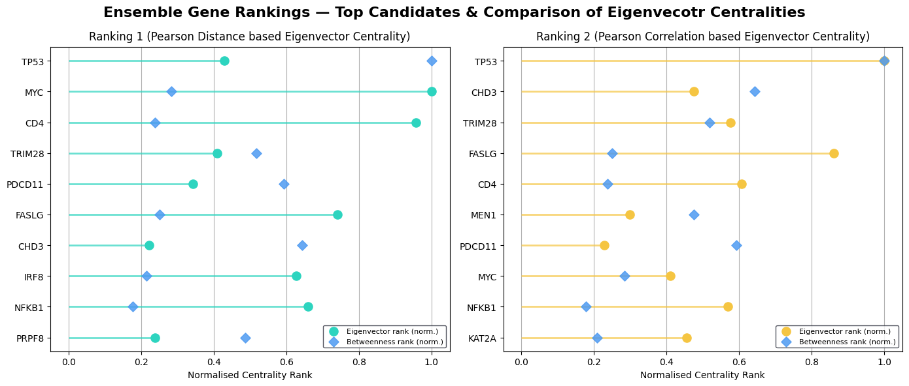
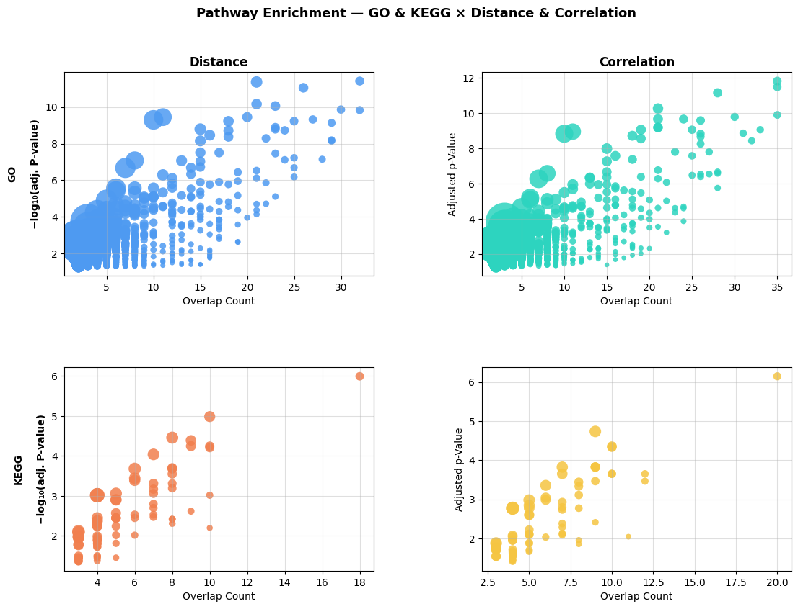
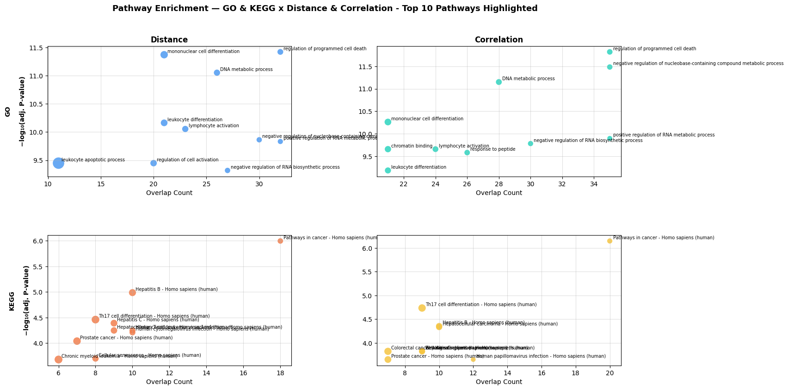

# Knowledge Graphs & Algorithms Lab Course

#### Presentation of Results by David Buchmann

---

# Data

- Chosen Dataset: [GSE239282](https://www.ncbi.nlm.nih.gov/geo/query/acc.cgi?acc=GSE239282)
- Topic: Age-related cognitive disorders (Alzheimers, etc.) - Treatment with Music 
- Total of 60 samples, before and after treatment
  - 16 disease (ACD), 14 control samples used (timepoint 2)
- Raw data:
  - 38327 unique gene rows across ACD & Control
- GEO2R:
  - 16951 genes with analyzed expression

---

# Methods

- Download of Raw Data & GEO2R Analysis
- Calculation of (Mutual) Information Gain & above average filtering
- Setup of PPI network based on StringDB based on our proteins
- Mapped pearson's correlation as edge distance
- Calculated Betweenness and Eigenvector Centrality
  - EC once using Distance (1-PC), once using PC
  - Only kept above average EC & BC genes
- Ranked (normalized) EC & BC - combined into ensemble ranking
- Gene Set Enrichment Analysis via GSEAPY on KEGG & GO pathways

---

# Results
### Data Statistics

- 3041 raw data gene rows after NaN filtering & HGNC mapping
- 3091 GEO2R genes after NaN filtering & HGNC mapping
- 1419 genes after filtering using Information gain
- 1142 genes/nodes after mapping to StringDB's PPI
- 89 (correlation) / 77 (distance) genes remaining after above average centralities filtering
- 945 (correlation) / 882 (distance) total hits for gene set enrichment analysis

---

# Results
### Top 5 Gene Results

- Top 5 DiCE Genes:
- [TP53](https://doi.org/10.3389/fnagi.2022.835288), CHD3, [TRIM28](https://doi.org/10.7554/elife.19809), [FASLG](https://doi.org/10.1016/S0969-9961(02)00019-0), [CD4](https://doi.org/10.1016/j.ygeno.2024.110976) (+ [MYC](https://doi.org/10.2353/ajpath.2009.080583) & PDCD11)
- CHD3 (ranked 2 & 7) not directly related (but with [neurodevelopmental disorders](https://doi.org/10.1038/s41586-026-10113-6))
- PDCD11 (ranked 7 & 5) also not directly related, but could be related via [ribosome biogenesis](https://maayanlab.cloud/Harmonizome/gene/PDCD11) and may increase the risk for neuropsychiatric disorders
- The missing genes found in the distance-based top 10 are higher ranked than the missing ones found in the correlaton-based top 10. (11&17 vs. 20&24)

---

# Results
### Ensemble Gene Ranking Plot

---

# Results
### KEGG Pathway Analysis

- 81/882 & 73/945 total hits
- Higher Overlap for Correlation-based enrichment
- Top 5 Overlaps include [Cancer](https://www.kegg.jp/pathway/hsa05200), [HPV](https://www.kegg.jp/pathway/hsa05165), [PI3K-Akt signaling](https://www.kegg.jp/pathway/hsa04151), [Herpes](https://www.kegg.jp/pathway/hsa05168) and [Hepatocellular carcinoma](https://www.kegg.jp/pathway/hsa05225) pathways
- The Distance-based results also included both [Hepatitis B](https://www.kegg.jp/pathway/hsa05161) as well as [Hepatitis C](https://www.kegg.jp/pathway/hsa05160) in its largest overlaps

---

# Results
### KEGG Interpretation

- All of the pathways not mentioned in the [paper](https://pmc.ncbi.nlm.nih.gov/articles/PMC10692168/) anywhere
- Old people were studied! --> High(er) likelihood of other diseases
- Cancer, HPV and Herpes infections very possible
- PI3K-Akt signaling seems meaningful since it is directly [linked](https://doi.org/10.1007/s12192-021-01231-3) to Alzheimer's Disease
  - Inhibits the hyperphosphorylation of Tau according to [research](https://doi.org/10.3389/fphar.2021.648636)

---

# Results
### Pathway Enrichment Full Volcano Plot

Reminder: We had 77 vs. 89 DiCE genes

---

# Results
### GO Pathway analysis

- 801/882 & 872/945 total hits
- Higher Overlap for Correlation-based enrichment
- Top 5 Overlaps include [programmed cell death](https://amigo.geneontology.org/amigo/term/GO:0043067), [RNA metabolism](https://amigo.geneontology.org/amigo/term/GO:0051254), [nucleobase compound metabolism](https://amigo.geneontology.org/amigo/term/GO:0045934), [signaling](https://amigo.geneontology.org/amigo/term/GO:0023056) & [Interspecies Interaction](https://amigo.geneontology.org/amigo/term/GO:0044419)
- The distance-based approach also included the [regulation of immune system process](https://amigo.geneontology.org/amigo/term/GO:0002682)
- High DiCE gene overlaps (largest being 32/77 & 35/89)

---

# Results
### GO Interpretation

- GO Terms & Pathways are too general to associate them directly
- Programmed cell death makes a lot of sense nonetheless!
  - Plays a major role both in elderly people as well as in Alzheimer's

---

---

# Results
### Comparison to simple logFC cutoff

- Keeps 194 genes from DEA results using a cutoff of |logFC ≥ 1|
- However, only gets 20 Pathway Hits for Enrichment (with p-value < 0.05)!
  - Only finds GO, no KEGG pathways
  - Ratio of $\frac{20}{194}$ compared to $\frac{945}{89}$!
  - 0.103 vs. 10.62 "pathways per gene"! Over 100-fold increase!
- Also finds similar pathways: [Interspecies Interaction](https://amigo.geneontology.org/amigo/term/GO:0044419) is the top pathway, 12 out of 20 pathways were also found in DiCE analysis
- Seems to find more immune-response associated pathways
- Overlap is similar for top hit, but quickly falls off afterwards

---

# Conclusion

- Correlation as edge weight for Eigenvector centrality is the correct choice
- Managed to identify many known directly & indirectly related (DiCE) genes
- Pathway enrichment results were good, but too general to directly interpret
- DiCE analysis is worth it compared to strict logFC cutoff!
- Managed a 100-fold increase in "pathways per gene" for GSEA